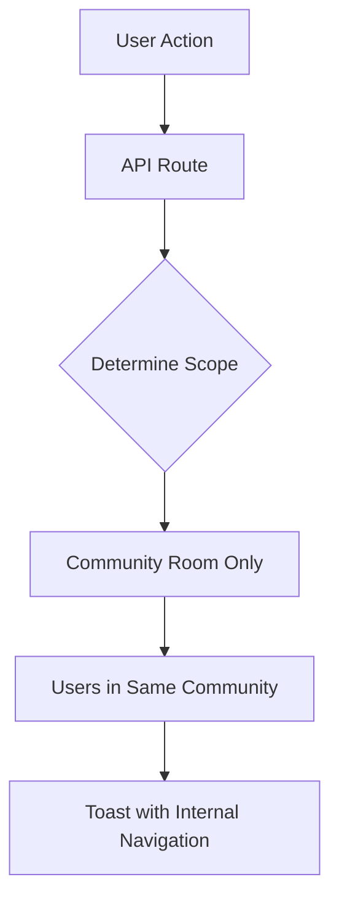
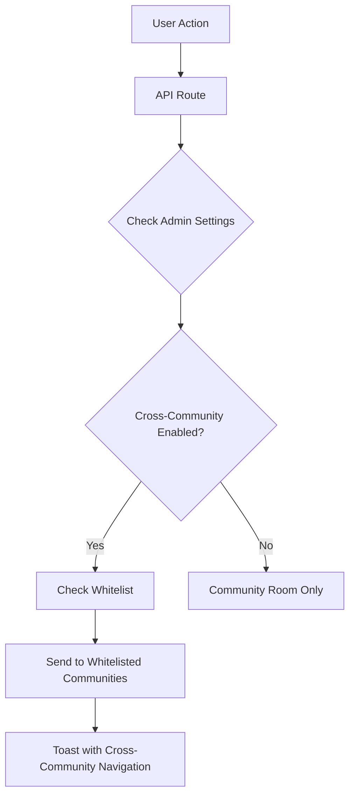

# Community-Scoped Notification Architecture Research

## 🎯 **Executive Summary**

**Current Problem**: The existing "global" Socket.IO room broadcasts notifications to ALL users across ALL communities without any scoping or admin control. This creates notification spam and broken navigation links.

**Proposed Solution**: Implement a hierarchical notification system with community-scoped rooms as the default, plus an opt-in cross-community notification system with admin whitelisting capabilities.

---

## 🚨 **Current Architecture Problems**

### **Issue 1: Unscoped Global Broadcasting**
```typescript
// Current broken pattern
socket.join('global');  // ❌ EVERYONE gets EVERYTHING
io.to('global').emit('voteUpdate', payload);  // Sends to all communities
```

**Problems**:
- Users in Community A get notifications about posts in Community B, C, D...
- Notification volume becomes overwhelming
- Navigation links break (try to open cross-community posts locally)
- No admin control over what communities interact

### **Issue 2: No Community Boundaries** 
```typescript
// Current room structure
'global'              // All users from all communities
'board:${boardId}'    // Users viewing specific boards (any community)
```

**Missing**:
- Community-level isolation
- Ability to scope notifications by community
- Admin preferences for cross-community interaction

### **Issue 3: Broken Cross-Community Navigation**
- Cross-community notifications happen accidentally
- Toast actions use internal navigation only
- Users click "View Post" → 404 or wrong content

---

## 🏗️ **Proposed New Architecture**

### **Hierarchical Room Structure**

```typescript
// 1. Community Rooms (PRIMARY - most notifications)
`community:${communityId}`           // All users in specific community
`community:${communityId}:admins`    // Admin-only notifications

// 2. Board Rooms (SCOPED - within community context)  
`community:${communityId}:board:${boardId}`  // Board-specific, community-scoped

// 3. Cross-Community Rooms (OPT-IN - admin controlled)
`cross-community:${sourceId}:${targetId}`    // Bilateral relationship
`cross-community:global`                     // True global (admin opt-in only)

// 4. Special Purpose Rooms
`admin:global`                       // Platform admin notifications
`community:${communityId}:presence`  // Presence-only notifications
```

### **Notification Flow Design**

#### **Community-Scoped (Default)**


#### **Cross-Community (Admin Enabled)**


---

## 🗄️ **Database Schema Requirements**

### **New Table: `community_notification_settings`**
```sql
CREATE TABLE community_notification_settings (
  id SERIAL PRIMARY KEY,
  community_id TEXT NOT NULL REFERENCES communities(id) ON DELETE CASCADE,
  
  -- Cross-community notification preferences
  enable_cross_community_notifications BOOLEAN DEFAULT FALSE,
  enable_receiving_notifications BOOLEAN DEFAULT FALSE,
  enable_sending_notifications BOOLEAN DEFAULT FALSE,
  
  -- Global notification preferences (platform-level features)
  enable_global_announcements BOOLEAN DEFAULT TRUE,
  enable_global_system_updates BOOLEAN DEFAULT TRUE,
  
  -- Notification types to receive from other communities
  allow_post_notifications BOOLEAN DEFAULT FALSE,
  allow_vote_notifications BOOLEAN DEFAULT FALSE,
  allow_comment_notifications BOOLEAN DEFAULT FALSE,
  allow_board_notifications BOOLEAN DEFAULT FALSE,
  
  -- Rate limiting and filtering
  max_notifications_per_hour INTEGER DEFAULT 10,
  min_vote_threshold_for_notifications INTEGER DEFAULT 5,
  
  created_at TIMESTAMPTZ DEFAULT CURRENT_TIMESTAMP,
  updated_at TIMESTAMPTZ DEFAULT CURRENT_TIMESTAMP,
  
  CONSTRAINT unique_community_notification_settings 
    UNIQUE (community_id)
);
```

### **New Table: `community_notification_whitelist`**
```sql
CREATE TABLE community_notification_whitelist (
  id SERIAL PRIMARY KEY,
  source_community_id TEXT NOT NULL REFERENCES communities(id) ON DELETE CASCADE,
  target_community_id TEXT NOT NULL REFERENCES communities(id) ON DELETE CASCADE,
  
  -- Relationship details
  relationship_type VARCHAR(50) DEFAULT 'partner', -- 'partner', 'ecosystem'
  is_bidirectional BOOLEAN DEFAULT FALSE,
  
  -- Notification permissions for this relationship
  allow_post_notifications BOOLEAN DEFAULT TRUE,
  allow_vote_notifications BOOLEAN DEFAULT FALSE,
  allow_comment_notifications BOOLEAN DEFAULT FALSE,
  allow_board_notifications BOOLEAN DEFAULT FALSE,
  
  -- Admin who approved this relationship
  approved_by_user_id TEXT REFERENCES users(user_id),
  approved_at TIMESTAMPTZ DEFAULT CURRENT_TIMESTAMP,
  
  -- Status tracking
  status VARCHAR(20) DEFAULT 'active', -- 'active', 'paused', 'expired'
  expires_at TIMESTAMPTZ,
  
  created_at TIMESTAMPTZ DEFAULT CURRENT_TIMESTAMP,
  updated_at TIMESTAMPTZ DEFAULT CURRENT_TIMESTAMP,
  
  CONSTRAINT unique_community_relationship 
    UNIQUE (source_community_id, target_community_id),
  CONSTRAINT no_self_whitelist 
    CHECK (source_community_id != target_community_id)
);
```

### **Enhancement: Add to `communities` table**
```sql
ALTER TABLE communities ADD COLUMN IF NOT EXISTS notification_settings JSONB DEFAULT '{}';

-- Index for fast notification queries
CREATE INDEX IF NOT EXISTS idx_communities_notification_settings 
  ON communities USING gin (notification_settings);
```

---

## 🎛️ **Admin Interface Requirements**

### **Community Settings → Notifications Tab**

#### **Section 1: Cross-Community Notifications**
```typescript
interface CrossCommunityNotificationSettings {
  enabled: boolean;
  mode: 'disabled' | 'whitelist_only' | 'open_network';
  
  // Receiving preferences
  receiveNotifications: {
    posts: boolean;
    votes: boolean;
    comments: boolean;
    boards: boolean;
  };
  
  // Sending preferences  
  sendNotifications: {
    posts: boolean;
    votes: boolean;
    comments: boolean;
    boards: boolean;
  };
  
  // Rate limiting
  maxNotificationsPerHour: number;
  minVoteThresholdForNotifications: number;
}
```

#### **Section 2: Community Whitelist Management**
```typescript
interface CommunityWhitelistEntry {
  communityId: string;
  communityName: string;
  communityShortId: string;
  relationshipType: 'partner' | 'ecosystem';
  isBidirectional: boolean;
  permissions: NotificationPermissions;
  status: 'active' | 'paused' | 'expired';
  approvedBy: string;
  approvedAt: Date;
  expiresAt?: Date;
}

// UI Components needed:
// - Community search/browse for whitelist additions
// - Relationship type selector
// - Permission matrix (notification types × communities)
// - Bulk enable/disable controls
// - Expiration date settings
```

#### **Section 3: Global Platform Settings** 
```typescript
interface GlobalNotificationSettings {
  receiveSystemUpdates: boolean;
  receiveAnnouncents: boolean;
  receivePlatformAlerts: boolean;
  
  // Future: federation with other Common Ground instances
  enableFederatedNotifications: boolean;
}
```

---

## 🔧 **Server-Side Implementation**

### **Enhanced Socket.IO Connection Logic**
```typescript
// server.ts - Enhanced room joining
socket.on('connection', (socket: AuthenticatedSocket) => {
  const user = socket.data.user;
  const communityId = user.cid;
  
  // 1. Always join community room (primary)
  socket.join(`community:${communityId}`);
  
  // 2. Join admin room if user is admin
  if (user.adm) {
    socket.join(`community:${communityId}:admins`);
  }
  
  // 3. Check cross-community settings and join appropriate rooms
  const crossCommunitySettings = await getCommunityNotificationSettings(communityId);
  
  if (crossCommunitySettings.enableReceiving) {
    // Join cross-community rooms based on whitelist
    const whitelistedCommunities = await getCommunityWhitelist(communityId);
    
    whitelistedCommunities.forEach(targetCommunity => {
      socket.join(`cross-community:${targetCommunity.id}:${communityId}`);
    });
  }
  
  // 4. Join global room only if explicitly enabled by admin
  if (crossCommunitySettings.enableGlobalNotifications) {
    socket.join('cross-community:global');
  }
});
```

### **Smart Broadcasting Logic**
```typescript
// Enhanced broadcasting function
interface BroadcastConfig {
  eventName: string;
  payload: Record<string, unknown>;
  scope: 'community' | 'cross-community' | 'global';
  communityId: string;
  notificationType: 'post' | 'vote' | 'comment' | 'board';
}

async function smartBroadcast(config: BroadcastConfig) {
  const { eventName, payload, scope, communityId, notificationType } = config;
  
  // 1. Always send to source community
  io.to(`community:${communityId}`).emit(eventName, {
    ...payload,
    isLocalNotification: true
  });
  
  // 2. Check if cross-community broadcasting is enabled
  if (scope === 'cross-community' || scope === 'global') {
    const settings = await getCommunityNotificationSettings(communityId);
    
    if (settings.enableSending && settings.sendNotifications[notificationType]) {
      // Get whitelisted communities that want this type of notification
      const targetCommunities = await getNotificationTargets(
        communityId, 
        notificationType
      );
      
      targetCommunities.forEach(targetCommunity => {
        // Check rate limits before sending
        if (checkRateLimit(communityId, targetCommunity.id)) {
          io.to(`community:${targetCommunity.id}`).emit(eventName, {
            ...payload,
            isCrossCommunityNotification: true,
            sourceCommunityId: communityId,
            sourceCommunityName: targetCommunity.sourceName,
            // Include cross-community navigation metadata
            crossCommunityNav: {
              communityShortId: payload.communityShortId,
              pluginId: payload.pluginId
            }
          });
        }
      });
    }
  }
}
```

---

## 🚀 **Implementation Phases**

### **Phase 1: Foundation (Database & Basic Rooms)**
**Goal**: Establish community-scoped notifications without breaking existing functionality

**Tasks**:
1. Create database tables (`community_notification_settings`, `community_notification_whitelist`)
2. Update server.ts to use community rooms instead of global room
3. Modify existing broadcast calls to use `community:${communityId}` 
4. Add backward compatibility layer

**Success Criteria**:
- All notifications stay within communities
- No cross-community notification spam
- Existing functionality works unchanged

### **Phase 2: Admin Interface**
**Goal**: Give community admins control over notification settings

**Tasks**:
1. Create notification settings UI in community settings
2. Implement community whitelist management interface
3. Add API endpoints for notification preferences
4. Build community discovery/search for whitelist

**Success Criteria**:
- Admins can enable/disable cross-community notifications
- Admins can whitelist specific communities
- Settings persist and apply in real-time

### **Phase 3: Cross-Community Notifications**
**Goal**: Enable controlled cross-community notifications with proper navigation

**Tasks**:
1. Implement smart broadcasting logic with whitelist checking
2. Add cross-community navigation to toast notifications
3. Implement rate limiting and filtering
4. Add notification type controls (posts vs votes vs comments)

**Success Criteria**:
- Whitelisted communities receive notifications from partners
- Toast actions navigate correctly to other communities
- Rate limiting prevents spam

### **Phase 4: Advanced Features**
**Goal**: Polish and advanced notification features

**Tasks**:
1. Implement notification analytics and insights
2. Add notification preview/testing for admins
3. Build notification templates and customization
4. Add federation support for external Common Ground instances

**Success Criteria**:
- Rich analytics on notification engagement
- Admin testing and preview capabilities
- Customizable notification content

---

## ⚠️ **Edge Cases & Considerations**

### **Migration Strategy**
- **Gradual rollout**: Start with community rooms, add cross-community as opt-in
- **Backward compatibility**: Maintain existing notification behavior during transition
- **Data migration**: Convert existing implicit cross-community relationships to explicit whitelist entries

### **Performance Considerations**
- **Room scaling**: Community rooms scale better than single global room
- **Rate limiting**: Prevent notification spam between communities
- **Caching**: Cache notification settings and whitelist for fast lookups
- **Database indexing**: Optimize queries for real-time notification routing

### **User Experience**
- **Notification fatigue**: Careful defaults to prevent overwhelming users
- **Visual differentiation**: Clear UI indicators for cross-community vs local notifications
- **Privacy**: Respect community boundaries and admin preferences
- **Discoverability**: Help communities find relevant partners for whitelisting

### **Security & Privacy**
- **Admin permissions**: Only community admins can modify notification settings
- **Data exposure**: Whitelist relationships are visible to both communities
- **Audit logging**: Track changes to notification settings and whitelist
- **Rate limiting**: Prevent abuse of cross-community notifications

### **Technical Debt**
- **Legacy notification code**: Gradual replacement of hardcoded global room usage
- **Interface consistency**: Ensure all notification types follow same patterns
- **Testing**: Comprehensive testing of notification routing logic
- **Monitoring**: Observability for notification delivery and performance

---

## 📊 **Success Metrics**

### **Community Health**
- **Notification relevance**: % of notifications users engage with
- **Cross-community engagement**: Successful cross-community interactions
- **Admin satisfaction**: Survey feedback on notification control features

### **Technical Performance**
- **Notification delivery time**: < 500ms for community notifications
- **Room scaling**: Support for 1000+ users per community room
- **Rate limit effectiveness**: Zero spam complaints after implementation

### **Platform Growth**
- **Community partnerships**: Number of active whitelist relationships
- **Cross-community discovery**: New communities discovered through notifications
- **Feature adoption**: % of communities that enable cross-community notifications

---

This architecture provides a solid foundation for community-scoped notifications while enabling controlled cross-community interaction. The phased implementation approach ensures we can deliver value incrementally while maintaining system stability. 