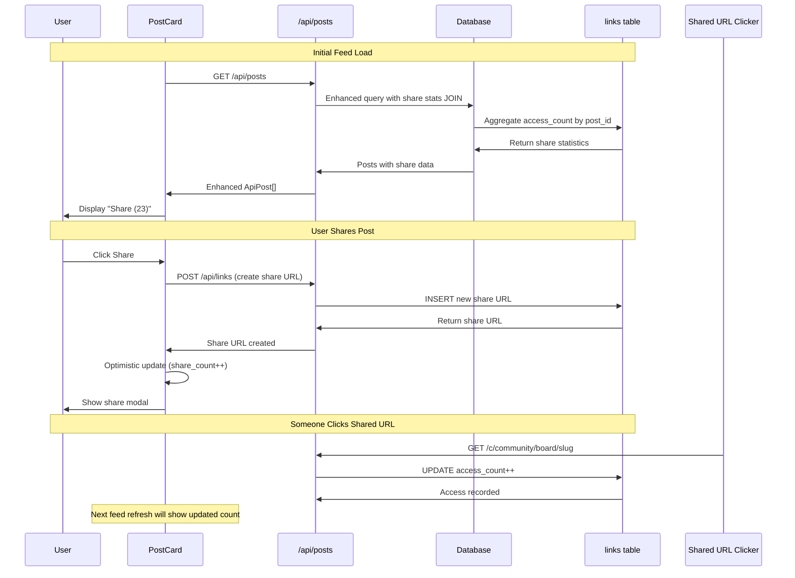

# Share Access Count Integration Research

## 📊 **Project Overview**

**Goal**: Display semantic URL access counts in PostCard share buttons to show sharing engagement

**Current**: `Share` button with no analytics visibility  
**Target**: `Share (23)` button showing how many times shared links have been accessed

**Approach**: Enhance existing post data queries instead of separate API endpoints for maximum efficiency

---

## 🔍 **Current System Analysis**

### **Post Data Flow**
```mermaid
graph LR
    A[PostCard] --> B[FeedList] --> C[useInfiniteScroll] --> D[/api/posts] --> E[Database]
    F[PostDetail] --> G[useQuery] --> H[/api/posts/[postId]] --> E
```

### **Share System Flow**
```mermaid
graph LR
    A[Share Button] --> B[buildExternalShareUrl] --> C[/api/links] --> D[links table]
    E[Shared URL Click] --> F[/c/[...path]] --> G[recordAccess] --> D
```

### **Key Database Tables**
```sql
-- posts table (existing)
posts (id, title, author_user_id, upvote_count, comment_count, ...)

-- links table (semantic URLs)
links (id, post_id, access_count, created_at, expires_at, ...)
```

---

## 🎯 **Technical Specification**

### **1. Database Query Enhancement**

#### **Current Post Queries**
```sql
-- Current: /api/posts feed query
SELECT p.*, b.name as board_name, u.name as author_name
FROM posts p
LEFT JOIN boards b ON p.board_id = b.id
LEFT JOIN users u ON p.author_user_id = u.user_id
ORDER BY p.created_at DESC;
```

#### **Enhanced Queries with Share Stats**
```sql
-- Enhanced: Include semantic URL access stats
SELECT 
  p.*,
  b.name as board_name,
  u.name as author_name,
  -- Share statistics from links table
  COALESCE(share_stats.total_access_count, 0) as share_access_count,
  COALESCE(share_stats.share_count, 0) as share_count,
  share_stats.last_shared_at,
  share_stats.most_recent_access_at
FROM posts p
LEFT JOIN boards b ON p.board_id = b.id  
LEFT JOIN users u ON p.author_user_id = u.user_id
LEFT JOIN (
  SELECT 
    post_id,
    SUM(access_count) as total_access_count,
    COUNT(*) as share_count,
    MAX(created_at) as last_shared_at,
    MAX(last_accessed_at) as most_recent_access_at
  FROM links 
  WHERE expires_at IS NULL OR expires_at > NOW()
  GROUP BY post_id
) share_stats ON p.id = share_stats.post_id
ORDER BY p.created_at DESC;
```

### **2. API Interface Changes**

#### **Enhanced Post Interface**
```typescript
// src/app/api/posts/route.ts
export interface ApiPost {
  // ... existing fields
  id: number;
  title: string;
  content: string;
  author_user_id: string;
  author_name?: string;
  upvote_count: number;
  comment_count: number;
  created_at: string;
  board_id: number;
  board_name?: string;
  
  // 🆕 New share analytics fields
  share_access_count: number;      // Total clicks on all shared URLs for this post
  share_count: number;             // Number of different shared URLs created
  last_shared_at?: string;         // When most recent share URL was created
  most_recent_access_at?: string;  // When shared URL was last clicked
}
```

#### **Database Mapping Enhancement**
```typescript
// In post mapping function
function mapPostFromDatabase(row: any): ApiPost {
  return {
    // ... existing mappings
    id: row.id,
    title: row.title,
    upvote_count: row.upvote_count,
    comment_count: row.comment_count,
    
    // 🆕 New share analytics mappings
    share_access_count: parseInt(row.share_access_count) || 0,
    share_count: parseInt(row.share_count) || 0,
    last_shared_at: row.last_shared_at || null,
    most_recent_access_at: row.most_recent_access_at || null,
  };
}
```

### **3. Frontend Integration**

#### **PostCard Display Logic**
```typescript
// src/components/voting/PostCard.tsx
export const PostCard: React.FC<PostCardProps> = ({ post }) => {
  // ... existing code

  const renderShareButton = () => {
    const accessCount = post.share_access_count || 0;
    const hasBeenShared = post.share_count > 0;
    
    return (
      <Button 
        variant="ghost" 
        size="sm" 
        onClick={handleShare}
        disabled={isGeneratingShareUrl}
        title={getShareButtonTitle(accessCount, hasBeenShared)}
      >
        {isGeneratingShareUrl ? (
          <div className="animate-spin rounded-full h-3.5 w-3.5 border-b-2 border-current" />
        ) : (
          <>
            <Share2 size={14} />
            {accessCount > 0 && (
              <span className="ml-1 text-xs opacity-75">
                ({formatAccessCount(accessCount)})
              </span>
            )}
          </>
        )}
      </Button>
    );
  };

  const getShareButtonTitle = (count: number, hasBeenShared: boolean) => {
    if (!hasBeenShared) return "Share this post";
    if (count === 0) return "Share this post (shared but not yet accessed)";
    if (count === 1) return "Share this post (1 person accessed via shared link)";
    return `Share this post (${count} people accessed via shared links)`;
  };

  const formatAccessCount = (count: number): string => {
    if (count < 1000) return count.toString();
    if (count < 10000) return `${(count / 1000).toFixed(1)}k`;
    return `${Math.floor(count / 1000)}k`;
  };

  // ... rest of component
};
```

#### **Optimistic Updates**
```typescript
// After successful share creation, update the post data
const handleShareSuccess = (newShareUrl: string) => {
  // Update the post in React Query cache
  queryClient.setQueryData(
    ['posts', /* feed query key */],
    (oldData: InfiniteData<ApiPost[]>) => {
      return {
        ...oldData,
        pages: oldData.pages.map(page =>
          page.map(p => 
            p.id === post.id 
              ? { 
                  ...p, 
                  share_count: p.share_count + 1,
                  last_shared_at: new Date().toISOString()
                }
              : p
          )
        )
      };
    }
  );
  
  // Note: Don't increment access_count - that only happens when people click the link
};
```

---

## 🚀 **Implementation Roadmap**

### **Phase 1: Database & API Enhancement (3-4 hours)**

#### **1.1 Database Query Updates (1.5 hours)**
- [ ] Update post feed query in `/api/posts/route.ts`
- [ ] Update individual post query in `/api/posts/[postId]/route.ts`  
- [ ] Add share stats subquery with proper JOINs
- [ ] Test query performance with large datasets
- [ ] Add database indexes if needed for performance

#### **1.2 API Interface Updates (1 hour)**
- [ ] Update `ApiPost` interface with new share fields
- [ ] Update database mapping functions
- [ ] Ensure backward compatibility (default values)
- [ ] Update TypeScript types across codebase

#### **1.3 Testing & Validation (1.5 hours)**
- [ ] Test API responses include share data
- [ ] Test posts with no shares (should show 0)
- [ ] Test posts with multiple shares (should sum correctly)
- [ ] Test posts with expired shares (should exclude)
- [ ] Verify performance with large post feeds

### **Phase 2: Frontend Integration (2-3 hours)**

#### **2.1 PostCard Enhancement (1.5 hours)**
- [ ] Update PostCard to display access count
- [ ] Add conditional rendering logic (only show if > 0)
- [ ] Add number formatting (1.2k for large numbers)
- [ ] Add proper tooltips/titles for accessibility
- [ ] Test responsive design (mobile vs desktop)

#### **2.2 Optimistic Updates (1 hour)**
- [ ] Update React Query cache after successful sharing
- [ ] Handle optimistic share_count increment
- [ ] Handle error rollback if sharing fails
- [ ] Test cache invalidation scenarios

#### **2.3 Polish & UX (30 minutes)**
- [ ] Add hover effects and transitions
- [ ] Ensure proper spacing and alignment
- [ ] Test dark/light theme compatibility
- [ ] Add loading states during share creation

### **Phase 3: Testing & Edge Cases (1 hour)**

#### **3.1 Comprehensive Testing**
- [ ] Test with posts that have never been shared
- [ ] Test with posts shared multiple times by different users
- [ ] Test with expired shares (should not count)
- [ ] Test with high access counts (1000+)
- [ ] Test mobile responsiveness

#### **3.2 Performance Validation**
- [ ] Measure API response time impact
- [ ] Test feed loading with 50+ posts
- [ ] Verify database query performance
- [ ] Check React Query cache behavior

#### **3.3 Edge Case Handling**
- [ ] Very high access counts (display formatting)
- [ ] Database errors (graceful fallback to 0)
- [ ] Missing share data (default values)
- [ ] Network failures during optimistic updates

---

## 🎨 **Visual Design Specification**

### **Share Button States**

#### **Never Shared**
```jsx
<Button>
  <Share2 size={14} />
</Button>
// Tooltip: "Share this post"
```

#### **Shared but No Clicks**
```jsx
<Button>
  <Share2 size={14} />
</Button>
// Tooltip: "Share this post (shared but not yet accessed)"
```

#### **Shared with Clicks**
```jsx
<Button>
  <Share2 size={14} />
  <span className="ml-1 text-xs opacity-75">(23)</span>
</Button>
// Tooltip: "Share this post (23 people accessed via shared links)"
```

#### **High Numbers**
```jsx
<Button>
  <Share2 size={14} />
  <span className="ml-1 text-xs opacity-75">(1.2k)</span>
</Button>
// Tooltip: "Share this post (1,234 people accessed via shared links)"
```

### **Mobile Responsiveness**
```css
/* Desktop: Full text */
.share-button-desktop {
  display: flex;
  align-items: center;
  gap: 0.25rem;
}

/* Mobile: Icon + count only */
@media (max-width: 640px) {
  .share-button-mobile .share-text {
    display: none;
  }
}
```

---

## 📈 **Performance Considerations**

### **Database Impact**
- **Query Complexity**: Added LEFT JOIN with subquery
- **Index Requirements**: Existing `links_post_id_idx` should be sufficient
- **Response Size**: Minimal increase (4 additional integer fields per post)
- **Query Time**: Estimated +5-10ms per query (negligible)

### **Frontend Impact**
- **Bundle Size**: No additional dependencies
- **Render Performance**: Minimal (simple conditional rendering)
- **Memory Usage**: +32 bytes per post (4 fields × 8 bytes)
- **Cache Impact**: Negligible increase in React Query cache size

### **Optimization Strategies**
```sql
-- If performance becomes an issue, consider materialized view
CREATE MATERIALIZED VIEW post_share_stats AS
SELECT 
  post_id,
  SUM(access_count) as total_access_count,
  COUNT(*) as share_count,
  MAX(created_at) as last_shared_at,
  MAX(last_accessed_at) as most_recent_access_at
FROM links 
WHERE expires_at IS NULL OR expires_at > NOW()
GROUP BY post_id;

-- Refresh strategy (could be triggered by share creation/access)
REFRESH MATERIALIZED VIEW post_share_stats;
```

---

## 🔄 **Data Flow Diagram**



---

## 🧪 **Testing Strategy**

### **Database Testing**
```sql
-- Test data setup
INSERT INTO posts (id, title, author_user_id, board_id) VALUES (1, 'Test Post', 'user1', 1);
INSERT INTO links (post_id, access_count, created_at) VALUES (1, 5, NOW());
INSERT INTO links (post_id, access_count, created_at) VALUES (1, 3, NOW());

-- Expected result: post with share_access_count = 8, share_count = 2
SELECT p.id, p.title, COALESCE(SUM(l.access_count), 0) as total_access
FROM posts p 
LEFT JOIN links l ON p.id = l.post_id 
WHERE p.id = 1
GROUP BY p.id, p.title;
```

### **Frontend Testing**
```typescript
// Mock data for testing
const mockPostWithShares: ApiPost = {
  id: 1,
  title: "Test Post",
  share_access_count: 23,
  share_count: 2,
  // ... other fields
};

const mockPostWithoutShares: ApiPost = {
  id: 2,
  title: "Unshared Post", 
  share_access_count: 0,
  share_count: 0,
  // ... other fields
};

// Test cases
describe('PostCard Share Button', () => {
  it('shows access count when > 0', () => {
    render(<PostCard post={mockPostWithShares} />);
    expect(screen.getByText('(23)')).toBeInTheDocument();
  });
  
  it('hides count when 0', () => {
    render(<PostCard post={mockPostWithoutShares} />);
    expect(screen.queryByText('(0)')).not.toBeInTheDocument();
  });
  
  it('formats large numbers correctly', () => {
    const highCountPost = { ...mockPostWithShares, share_access_count: 1234 };
    render(<PostCard post={highCountPost} />);
    expect(screen.getByText('(1.2k)')).toBeInTheDocument();
  });
});
```

---

## 📊 **Success Metrics**

### **Technical Metrics**
- [ ] **API Response Time**: < 200ms for post feed (including share stats)
- [ ] **Query Performance**: < 50ms for share stats JOIN on 10k posts
- [ ] **Frontend Render**: No noticeable performance impact on PostCard
- [ ] **Cache Efficiency**: React Query cache hit rate > 90%

### **User Experience Metrics**
- [ ] **Visual Integration**: Share count appears seamlessly in existing UI
- [ ] **Accessibility**: Proper tooltips and screen reader support
- [ ] **Responsive Design**: Works well on mobile and desktop
- [ ] **Information Clarity**: Users understand what the number represents

### **Data Accuracy Metrics**  
- [ ] **Count Accuracy**: Share access counts match actual link clicks
- [ ] **Real-time Updates**: New shares increment count within 5 minutes
- [ ] **Edge Case Handling**: Expired shares excluded from count
- [ ] **Multiple Shares**: Correctly sums access across all share URLs for a post

---

## 🚧 **Potential Challenges & Solutions**

### **Challenge 1: Query Performance**
**Issue**: JOIN with aggregation might slow down post feeds  
**Solution**: Add database indexes, consider materialized views for high-traffic cases

### **Challenge 2: Real-time Updates**
**Issue**: Access counts update when links are clicked, not immediately visible  
**Solution**: Document that counts update on next feed refresh (acceptable delay)

### **Challenge 3: Multiple Share URLs per Post**
**Issue**: One post can have multiple share URLs (different users, different times)  
**Solution**: Sum all access_count values - gives total engagement metric

### **Challenge 4: Display Space on Mobile**
**Issue**: Limited space for additional text  
**Solution**: Show count in compact format (23) with full details in tooltip

### **Challenge 5: Backward Compatibility**
**Issue**: Existing posts have no share data  
**Solution**: Use COALESCE to default to 0, handle gracefully in frontend

---

## 🎯 **Next Steps Summary**

### **Immediate Actions** 
1. **Start with Phase 1.1**: Update database queries in `/api/posts` routes
2. **Test performance**: Measure query time impact with real data
3. **Update interfaces**: Add share fields to `ApiPost` type

### **Success Criteria for Phase 1**
- All post API endpoints return share statistics
- No noticeable performance degradation  
- Backward compatibility maintained (existing clients work)

### **Decision Points**
- Should we include expired shares in the count? **Recommendation: No**
- Display threshold: Show (0) or only when > 0? **Recommendation: Only > 0**
- Mobile layout: Full count or abbreviated? **Recommendation: Full count**

**Ready to proceed with Phase 1 implementation?** This approach will give you real sharing analytics visibility without additional API overhead! 📈 