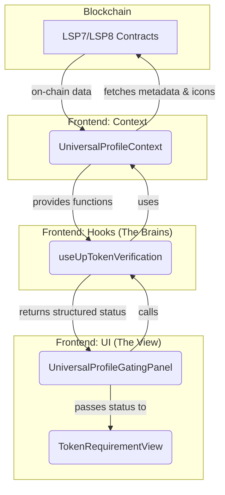

# Universal Profile Gating System: Architecture & Developer Guide

This document outlines the architecture of the Universal Profile (UP) gating system, explains the key components, and provides a guide for future development and maintenance.

## 1. High-Level Overview

The UP gating system is designed to verify a user's on-chain data against a set of requirements defined in a lock. The flow is unidirectional, ensuring a clean and maintainable separation of concerns:

**Data Flow:**
`Blockchain Data` -> `React Context` -> `Verification Hooks` -> `UI Components`

1.  **Context (`UniversalProfileContext.tsx`)**: Acts as the primary interface with the user's Universal Profile. It handles the connection state and provides low-level functions to fetch on-chain data like token metadata and icons.
2.  **Hooks (`src/hooks/gating/up/`)**: These are the "brains" of the operation. Each hook is responsible for a specific type of verification (e.g., token ownership, LYX balance). They consume data from the Context, perform their verification logic, and expose a clean, structured status object.
3.  **UI Components (`src/components/gating/up/` & `.../UniversalProfileGatingPanel.tsx`)**: These are "dumb" components that are only responsible for rendering the verification status provided by the hooks. They should contain minimal logic.

## 2. Key Components & File Responsibilities

Here are the core files involved in the UP gating process:

| File | Responsibility |
| :--- | :--- |
| **`src/contexts/UniversalProfileContext.tsx`** | **The Data Source**. Manages the UP wallet connection. Provides low-level functions like `getTokenBalances()` and `fetchTokenIcon()` that interact with the blockchain and cache results. It uses the official `erc725.js` library for robust LSP4 metadata fetching. |
| **`src/hooks/gating/up/useUpTokenVerification.ts`** | **The Logic Engine for Tokens**. This is the most critical hook. It fetches collection balances, verifies specific LSP8 token ID ownership via `tokenOwnerOf`, merges the results, and returns a comprehensive status object keyed correctly for each requirement. |
| **`src/hooks/gating/up/useUpLyxBalance.ts`** | **The Logic Engine for LYX**. A simpler hook dedicated to checking if the user's LYX balance meets the requirement. |
| **`src/hooks/gating/up/useUpFollowerVerification.ts`** | **The Logic Engine for Socials**. Verifies "must follow" or "must be followed by" requirements. |
| **`src/components/gating/UniversalProfileGatingPanel.tsx`** | **The UI Orchestrator**. This component takes the full set of UP requirements, calls the relevant verification hooks, and maps the results to the appropriate view components. It's responsible for using the correct key (e.g., composite key for LSP8s) to pass status to child components. |
| **`src/components/gating/up/TokenRequirementView.tsx`** | **The Final UI Display**. A small, focused component that renders the status of a *single* token requirement. It receives props and displays the token name, required amount/ID, and the final "Owned" / "Not Owned" status. |
| **`src/components/verification/UPVerificationWrapper.tsx`** | A simple wrapper that provides the `WagmiProvider` context necessary for the hooks to function. It's a structural component. |
| **`src/components/gating/GatingRequirementsPanel.tsx`** | The top-level panel that decides which verification "slot" to show (e.g., Universal Profile, Ethereum Profile). It renders the `UPVerificationWrapper`. |

### Data Flow Diagram

## 3. How to Add New Functionality

To add a new type of UP-based requirement (e.g., verifying a specific key-value pair in the user's profile):

1.  **Add a Fetcher (if needed) to `UniversalProfileContext.tsx`**: If the new requirement needs new on-chain data, add a new low-level fetcher function here. Keep it generic.
2.  **Create a New Hook**: Create a new file like `src/hooks/gating/up/useMyNewVerification.ts`. This hook will contain all the logic for checking the requirement. It should take the user's address and the requirement details as input and return `isLoading`, `error`, and a `verificationStatus` object.
3.  **Create a New View Component**: Create a new file like `src/components/gating/up/MyNewRequirementView.tsx`. This component will be responsible for *displaying* the status from your new hook. Keep it simple.
4.  **Integrate into the Panel**: In `UniversalProfileGatingPanel.tsx`, call your new hook and render your new view component, passing the status from the hook as props.

## 4. Dos and Don'ts (Best Practices)

Following these rules will prevent future regressions and keep the system maintainable.

### **DO ✅**

-   **Centralize Logic in Hooks**: All verification logic MUST reside in the `src/hooks/gating/up/` directory. Hooks are the single source of truth for verification status.
-   **Use Composite Keys for LSP8 NFTs**: When dealing with a requirement for a specific LSP8 `tokenId`, always use a composite key like `` `${contractAddress}-${tokenId}` `` for storing and retrieving its status.
-   **Use the Official `erc725.js` Library**: For any `LSP4Metadata` fetching, use `erc725.fetchData()`. It correctly handles the complex `VerifiableURI` decoding and is the official LUKSO standard.
-   **Keep View Components "Dumb"**: Components like `TokenRequirementView` should only be responsible for displaying data passed down as props. They should not contain any verification logic.
-   **Provide Clear, Specific UI Feedback**: The UI must clearly reflect the requirement. For a specific `tokenId`, it must show that `tokenId` and whether it is "Owned" or "Not Owned", not a generic collection balance.

### **DON'T ❌**

-   **NEVER put verification logic in UI components**: Do not make on-chain calls or run verification checks inside `TokenRequirementView` or `UniversalProfileGatingPanel`. This was the source of our previous bugs.
-   **NEVER use `contractAddress` alone as a key for specific NFTs**: This will cause all tokens in a collection to share the same status, which is incorrect for specific ID checks.
-   **NEVER try to manually parse `VerifiableURI` bytes**: The `erc725.js` library is designed to do this. Manual parsing is error-prone and led to the `invalid codepoint` errors.
-   **NEVER show users vague or summarized information**: Displaying "3 BASED owned" for a lock that requires 4 *specific* tokens is misleading and unhelpful. The UI must match the logic. 