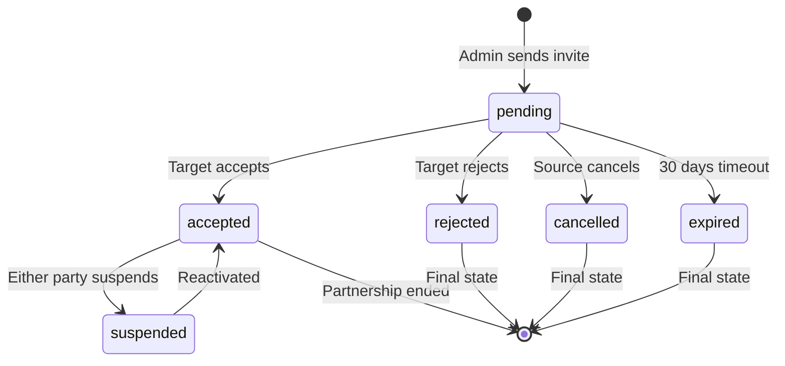

# Community Partnerships Foundation - Step 1 Research

## 🎯 **Overview**

**Goal**: Build the foundational infrastructure for community partnerships with an invite/accept flow (like friend requests, but for communities).

**Scope**: This is **Step 1** only - the basic partnership system. Smart suggestions and data archaeology come later in Step 2.

---

## 🗄️ **Database Schema**

### **Core Table: `community_partnerships`**

```sql
CREATE TABLE community_partnerships (
  id SERIAL PRIMARY KEY,
  
  -- Partnership parties
  source_community_id TEXT NOT NULL REFERENCES communities(id) ON DELETE CASCADE,
  target_community_id TEXT NOT NULL REFERENCES communities(id) ON DELETE CASCADE,
  
  -- Partnership state machine
  status VARCHAR(20) NOT NULL DEFAULT 'pending',
  -- 'pending'     - Invite sent, waiting for response
  -- 'accepted'    - Both communities agreed
  -- 'rejected'    - Target community declined
  -- 'cancelled'   - Source community cancelled invite
  -- 'expired'     - Invite expired without response
  -- 'suspended'   - Partnership temporarily disabled
  
  -- Relationship details
  relationship_type VARCHAR(50) DEFAULT 'partner',
  -- 'partner'     - Close collaboration and regular interaction
  -- 'ecosystem'   - Loose association, part of broader ecosystem
  
  -- Partnership permissions (both directions)
  source_to_target_permissions JSONB DEFAULT '{}',
  target_to_source_permissions JSONB DEFAULT '{}',
  
  -- Invite flow tracking
  invited_by_user_id TEXT NOT NULL REFERENCES users(user_id),
  invited_at TIMESTAMPTZ DEFAULT CURRENT_TIMESTAMP,
  
  responded_by_user_id TEXT REFERENCES users(user_id),
  responded_at TIMESTAMPTZ,
  
  -- Partnership lifecycle
  partnership_started_at TIMESTAMPTZ,
  partnership_ended_at TIMESTAMPTZ,
  
  -- Optional invite message and response
  invite_message TEXT,
  response_message TEXT,
  
  -- Metadata
  created_at TIMESTAMPTZ DEFAULT CURRENT_TIMESTAMP,
  updated_at TIMESTAMPTZ DEFAULT CURRENT_TIMESTAMP,
  
  -- Constraints
  CONSTRAINT unique_community_partnership 
    UNIQUE (source_community_id, target_community_id),
  CONSTRAINT no_self_partnership 
    CHECK (source_community_id != target_community_id),
  CONSTRAINT valid_status 
    CHECK (status IN ('pending', 'accepted', 'rejected', 'cancelled', 'expired', 'suspended'))
);

-- Indexes for performance
CREATE INDEX idx_community_partnerships_source ON community_partnerships(source_community_id);
CREATE INDEX idx_community_partnerships_target ON community_partnerships(target_community_id);
CREATE INDEX idx_community_partnerships_status ON community_partnerships(status);
CREATE INDEX idx_community_partnerships_invited_at ON community_partnerships(invited_at);

-- Index for finding all partnerships for a community (both directions)
CREATE INDEX idx_community_partnerships_lookup ON community_partnerships(source_community_id, target_community_id, status);
```

### **Permissions Schema**

```typescript
// TypeScript interface for partnership permissions
interface PartnershipPermissions {
  // Notification types this community allows from partner
  notifications: {
    posts: boolean;           // New post notifications
    votes: boolean;           // Vote milestone notifications  
    comments: boolean;        // New comment notifications
    boards: boolean;          // New board notifications
    announcements: boolean;   // Community announcements
  };
  
  // Rate limiting
  rateLimit: {
    maxPerHour: number;       // Max notifications per hour
    maxPerDay: number;        // Max notifications per day
  };
  
  // Content filtering
  filters: {
    minVoteThreshold: number; // Only notify for posts with X+ votes
    boardWhitelist: number[]; // Only notify for specific boards (empty = all)
  };
}

// Default permissions for new partnerships
const DEFAULT_PARTNERSHIP_PERMISSIONS: PartnershipPermissions = {
  notifications: {
    posts: true,
    votes: false,      // Conservative default
    comments: false,   // Conservative default  
    boards: true,
    announcements: true
  },
  rateLimit: {
    maxPerHour: 5,
    maxPerDay: 20
  },
  filters: {
    minVoteThreshold: 3,
    boardWhitelist: []
  }
};
```

---

## 🔄 **Partnership State Machine**

### **State Flow Diagram**


### **State Transitions**

| From | To | Trigger | Who Can Do |
|------|----|---------|-----------| 
| `pending` | `accepted` | Accept invite | Target community admin |
| `pending` | `rejected` | Reject invite | Target community admin |
| `pending` | `cancelled` | Cancel invite | Source community admin |
| `pending` | `expired` | Time passes | System (30 days) |
| `accepted` | `suspended` | Suspend partnership | Either community admin |
| `suspended` | `accepted` | Reactivate | Admin who suspended |
| `accepted` | `[ended]` | End partnership | Either community admin |

---

## 📡 **API Endpoints**

### **Partnership Management**

#### **1. Send Partnership Invite**
```typescript
POST /api/communities/[communityId]/partnerships/invites

interface SendPartnershipInviteRequest {
  targetCommunityId: string;
  relationshipType: 'partner' | 'ecosystem';
  inviteMessage?: string;
  proposedPermissions: {
    fromUs: PartnershipPermissions;    // What we're offering to send them
    toUs: PartnershipPermissions;      // What we'd like to receive from them
  };
}

interface SendPartnershipInviteResponse {
  success: boolean;
  partnershipId: number;
  status: 'pending';
  expiresAt: string;
}
```

#### **2. Respond to Partnership Invite**
```typescript
POST /api/communities/[communityId]/partnerships/[partnershipId]/respond

interface PartnershipResponseRequest {
  action: 'accept' | 'reject';
  responseMessage?: string;
  
  // If accepting, can modify proposed permissions
  modifiedPermissions?: {
    fromUs: PartnershipPermissions;
    toUs: PartnershipPermissions;  
  };
}

interface PartnershipResponseResponse {
  success: boolean;
  partnership: CommunityPartnership;
  requiresCounterApproval?: boolean;  // If permissions were modified
}
```

#### **3. List Partnerships**
```typescript
GET /api/communities/[communityId]/partnerships

interface ListPartnershipsResponse {
  active: CommunityPartnership[];      // accepted partnerships
  pending: {
    incoming: CommunityPartnership[];  // invites we received
    outgoing: CommunityPartnership[];  // invites we sent
  };
  recent: CommunityPartnership[];      // recently ended/rejected
}
```

#### **4. Update Partnership**
```typescript
PUT /api/communities/[communityId]/partnerships/[partnershipId]

interface UpdatePartnershipRequest {
  status?: 'suspended' | 'accepted';  // Suspend/reactivate
  permissions?: PartnershipPermissions;  // Update our permissions
}
```

#### **5. End Partnership**
```typescript
DELETE /api/communities/[communityId]/partnerships/[partnershipId]

interface EndPartnershipRequest {
  reason?: string;  // Optional reason for ending
}
```

### **Community Discovery** (for manual invite sending)

#### **6. Search Communities**
```typescript
GET /api/communities/search?q={query}&exclude_existing=true

interface CommunitySearchResponse {
  communities: {
    id: string;
    name: string;
    shortId: string;
    description?: string;
    memberCount?: number;
    isPartner: boolean;      // Already have partnership
    hasPendingInvite: boolean;  // Invite already sent
  }[];
}
```

---

## 🎨 **Frontend Components**

### **1. Partnership Management Page**
```typescript
// /community-settings → Partnerships tab
const CommunityPartnershipsPage = () => {
  return (
    <div className="space-y-6">
      <PartnershipInviteSection />      // Send new invites
      <PendingInvitesSection />         // Incoming/outgoing invites  
      <ActivePartnershipsSection />     // Current partnerships
      <PartnershipHistorySection />     // Past partnerships
    </div>
  );
};
```

### **2. Send Partnership Invite Modal**
```typescript
const SendPartnershipInviteModal = () => {
  const [selectedCommunity, setSelectedCommunity] = useState(null);
  const [relationshipType, setRelationshipType] = useState('partner');
  const [inviteMessage, setInviteMessage] = useState('');
  const [permissions, setPermissions] = useState(DEFAULT_PARTNERSHIP_PERMISSIONS);
  
  return (
    <Modal>
      <CommunitySearchInput onSelect={setSelectedCommunity} />
      <RelationshipTypeSelector value={relationshipType} onChange={setRelationshipType} />
      <PermissionsEditor permissions={permissions} onChange={setPermissions} />
      <MessageTextarea value={inviteMessage} onChange={setInviteMessage} />
      <SendInviteButton />
    </Modal>
  );
};
```

### **3. Partnership Invite Card**
```typescript
const PartnershipInviteCard = ({ invite }: { invite: CommunityPartnership }) => {
  return (
    <Card>
      <CardHeader>
        <CommunityAvatar community={invite.sourceCommunity} />
        <div>
          <h3>{invite.sourceCommunity.name}</h3>
          <p>wants to partner with your community</p>
          <Badge>{invite.relationshipType}</Badge>
        </div>
      </CardHeader>
      
      <CardContent>
        {invite.inviteMessage && (
          <blockquote>{invite.inviteMessage}</blockquote>
        )}
        
        <PermissionsPreview permissions={invite.proposedPermissions} />
        
        <div className="flex gap-2">
          <AcceptInviteButton inviteId={invite.id} />
          <RejectInviteButton inviteId={invite.id} />
          <ViewDetailsButton inviteId={invite.id} />
        </div>
      </CardContent>
    </Card>
  );
};
```

### **4. Active Partnership Card**
```typescript
const ActivePartnershipCard = ({ partnership }: { partnership: CommunityPartnership }) => {
  return (
    <Card>
      <CardHeader>
        <CommunityAvatar community={partnership.partnerCommunity} />
        <div>
          <h3>{partnership.partnerCommunity.name}</h3>
          <p>Partnership since {formatDate(partnership.partnershipStartedAt)}</p>
          <Badge variant="success">{partnership.relationshipType}</Badge>
        </div>
      </CardHeader>
      
      <CardContent>
        <PartnershipStats partnership={partnership} />
        <PermissionsDisplay permissions={partnership.permissions} />
        
        <div className="flex gap-2">
          <EditPermissionsButton partnershipId={partnership.id} />
          <SuspendPartnershipButton partnershipId={partnership.id} />
          <EndPartnershipButton partnershipId={partnership.id} />
        </div>
      </CardContent>
    </Card>
  );
};
```

---

## 🔔 **Notification System**

### **Partnership-Related Notifications**

#### **1. New Partnership Invite**
```typescript
// Real-time notification when invite received
socket.emit('partnershipInviteReceived', {
  partnershipId: number,
  sourceCommunity: CommunityInfo,
  relationshipType: string,
  inviteMessage?: string
});

// Toast notification
toast.info(`${sourceCommunity.name} wants to partner with your community`, {
  action: {
    label: 'Review Invite',
    onClick: () => router.push('/community-settings?tab=partnerships')
  }
});
```

#### **2. Partnership Status Updates**
```typescript
// When invite is accepted/rejected
socket.emit('partnershipStatusUpdate', {
  partnershipId: number,
  newStatus: 'accepted' | 'rejected',
  partnerCommunity: CommunityInfo
});

// Email notifications for important events
await sendEmail({
  to: communityAdmins,
  subject: `Partnership ${newStatus} - ${partnerCommunity.name}`,
  template: 'partnership-status-update',
  data: { partnership, newStatus }
});
```

---

## 🚀 **Implementation Plan**

### **Phase 1: Database & Core API (Week 1)**
1. Create database migration for `community_partnerships` table
2. Implement core API endpoints (invite, respond, list)
3. Add partnership state management logic
4. Write comprehensive tests

### **Phase 2: Admin Interface (Week 2)**  
1. Create partnership management page in community settings
2. Build send invite modal with community search
3. Create invite/response UI components
4. Add partnership list and management views

### **Phase 3: Integration & Polish (Week 3)**
1. Add real-time notifications for partnership events
2. Integrate partnership status into community profiles
3. Add partnership metrics and analytics
4. Polish UI and add loading/error states

### **Phase 4: Validation & Launch (Week 4)**
1. End-to-end testing with multiple communities
2. Admin feedback and UI refinements
3. Performance testing and optimization
4. Documentation and admin training

---

## ✅ **Success Criteria**

### **Functional Requirements**
- [ ] Admins can send partnership invites to other communities
- [ ] Admins can accept/reject incoming partnership invites  
- [ ] Partnership state is properly tracked and enforced
- [ ] Permissions system works for both directions
- [ ] Real-time notifications for partnership events

### **User Experience**
- [ ] Intuitive partnership management interface
- [ ] Clear visual distinction between invite states
- [ ] Easy community search and discovery
- [ ] Responsive design for mobile admins

### **Technical Requirements**
- [ ] Database constraints prevent invalid partnerships
- [ ] API endpoints have proper authentication/authorization
- [ ] Real-time updates via Socket.IO
- [ ] Comprehensive error handling and validation

---

This foundation provides the basic "friend request" system for communities. Once this is solid, we can add the smart suggestion algorithms in Step 2! 