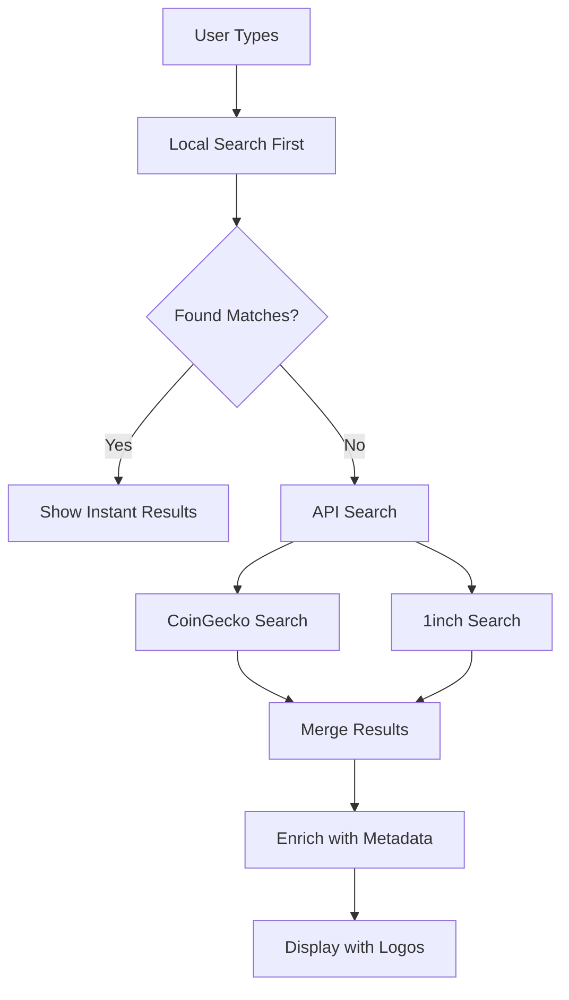

# Ethereum Gating Enhancement Roadmap

**Executive Summary:** Transform the Ethereum token gating experience from a functional but basic implementation to a rich, user-friendly system that matches or exceeds our Universal Profile reference implementation.

---

## 🎯 **Vision Statement**

Create a **best-in-class Ethereum token gating experience** that provides:
- **Instant token/NFT discovery** with intelligent auto-complete
- **Rich visual metadata** with logos, verification badges, and trust indicators  
- **Seamless requirement configuration** with real-time validation feedback
- **Professional UX polish** matching modern DeFi interfaces
- **Enhanced security** with spam/scam detection and verification status

---

## 📊 **Current State Analysis**

### ✅ **Strengths (What's Working)**
- **Solid backend verification**: Complete `verifyEthereumGatingRequirements()` function
- **Comprehensive token support**: ETH, ENS, ERC-20, ERC-721, ERC-1155, EF tokens
- **Proper BigNumber handling**: Accurate balance comparisons avoiding float precision issues
- **Pre-verification system**: Integrated with slot-based verification architecture
- **Security**: Challenge-response authentication with signature verification

### ❌ **Critical Gaps (What's Missing)**

#### **Frontend Experience Deficits**
1. **No Rich UI Components**
   - Missing equivalent of `RichRequirementsDisplay` 
   - No visual token/NFT selection interface
   - Basic form inputs vs polished UP widgets

2. **Manual Token Discovery**
   - Users must manually enter contract addresses
   - No auto-complete or search functionality
   - No logo/metadata display during selection

3. **Limited Visual Feedback**
   - No verification badges or trust indicators
   - No logos or rich metadata in requirements display
   - Missing real-time balance/ownership validation

4. **Inconsistent UX Patterns**
   - Different interaction patterns vs UP implementation
   - No unified verification button states
   - Missing loading states and error handling polish

#### **Backend Enhancement Opportunities**
1. **No Token Metadata Enrichment**
   - Backend only validates, doesn't provide rich metadata
   - No logo URLs or token descriptions stored/returned
   - No verification status or trust scoring

2. **Limited Anti-Spam Measures**
   - No scam token detection
   - No token allowlist/verification system
   - Users could add malicious contracts

---

## 🏗️ **Implementation Roadmap**

### **Phase 1: Token Discovery & Search Infrastructure** 
*Duration: 1-2 weeks*

#### **1.1 Token Search API Integration**
Create hybrid search system combining speed + comprehensiveness:

```typescript
// Multi-tier search strategy
interface TokenSearchService {
  // Tier 1: Instant local search (Uniswap token lists)
  searchLocalTokens(query: string): TokenResult[]
  
  // Tier 2: Real-time API search (CoinGecko/1inch)
  searchRemoteTokens(query: string): Promise<TokenResult[]>
  
  // Tier 3: Verification & metadata enrichment
  enrichTokenMetadata(address: string): Promise<TokenMetadata>
}
```

**API Integration Priority:**
1. **CoinGecko API** (free, excellent coverage, logos)
2. **1inch Token API** (fast, premium but robust)  
3. **Uniswap Token Lists** (instant local fallback)

#### **1.2 NFT Collection Search**
```typescript
interface NFTSearchService {
  // Primary: NFTPort multi-chain search
  searchCollections(query: string): Promise<NFTCollection[]>
  
  // Fallback: Alchemy NFT contract search  
  searchAlchemy(query: string): Promise<NFTCollection[]>
  
  // Enrichment: OpenSea verification status
  getCollectionMetadata(address: string): Promise<NFTMetadata>
}
```

#### **1.3 Enhanced Backend Endpoints**
```typescript
// New API endpoints
POST /api/ethereum/tokens/search
POST /api/ethereum/nfts/search  
GET  /api/ethereum/tokens/metadata/{address}
GET  /api/ethereum/nfts/metadata/{address}
```

### **Phase 2: Rich Frontend Components**
*Duration: 2-3 weeks*

#### **2.1 Token Selection Widget**
Create `EthereumTokenSelector` matching UP quality:

```tsx
<EthereumTokenSelector
  onTokenSelect={(token) => setSelectedToken(token)}
  showVerificationBadges={true}
  enableAutoComplete={true}
  filterSpamTokens={true}
/>
```

**Features:**
- Real-time search with debounced API calls
- Logo display and verification badges  
- Popular tokens suggestions
- Recent selections memory
- Spam token filtering

#### **2.2 Rich Requirements Display**
Build `EthereumRichRequirementsDisplay`:

```tsx
<EthereumRichRequirementsDisplay
  requirements={ethereumRequirements}
  userAddress={walletAddress}
  showBalance={true}
  showVerificationStatus={true}
/>
```

**Visual Elements:**
- Token logos and symbols
- Balance vs requirement comparison
- Green/red status indicators  
- Verification badges
- "You have X / Need Y" formatting

#### **2.3 Enhanced Connection Widget**
Upgrade `EthereumConnectionWidget` to match UP UX:

```tsx
<EthereumConnectionWidget
  requirements={requirements}
  onVerificationComplete={handleVerification}
  showProgressIndicators={true}
  autoDetectRequirements={true}
/>
```

### **Phase 3: Advanced UX Enhancements**
*Duration: 1-2 weeks*

#### **3.1 Smart Verification UX**
- **Intelligent button states**: Mimic UP verification button behavior
- **Real-time requirement checking**: Live balance validation
- **Clear error messaging**: Specific failure reasons
- **Progress indicators**: Step-by-step verification flow

#### **3.2 Trust & Security Features**
```typescript
interface TokenTrustScoring {
  verificationStatus: 'verified' | 'unverified' | 'suspicious' | 'spam'
  verificationSources: ('coinGecko' | 'uniswap' | 'oneInch')[]
  popularityScore: number
  riskFlags: string[]
}
```

#### **3.3 Advanced Token Configuration**
- **Minimum holdings suggestions**: Based on token economics
- **Dynamic requirement templates**: Common DeFi token amounts
- **Multi-token bundles**: AND/OR logic for complex requirements
- **Time-based requirements**: Holding duration verification

### **Phase 4: Performance & Polish**
*Duration: 1 week*

#### **4.1 Performance Optimizations**
- **Caching strategy**: Token metadata and logos
- **Request debouncing**: Efficient search API usage
- **Lazy loading**: Progressive enhancement
- **Offline fallbacks**: Local token lists when APIs unavailable

#### **4.2 Advanced Features**
- **Token allowlists**: Admin-curated safe token lists
- **Trending tokens**: Popular token suggestions
- **Market data integration**: Show token prices and market caps
- **Cross-chain indicators**: Multi-network token support

---

## 🔧 **Technical Implementation Details**

### **Token Search Architecture**



### **Data Flow Enhancement**

```typescript
// Enhanced requirement validation
interface EthereumRequirement {
  type: 'eth' | 'erc20' | 'erc721' | 'erc1155' | 'ens'
  // Rich metadata from APIs
  metadata: {
    name: string
    symbol: string
    logoURI?: string
    verified: boolean
    description?: string
    trustScore: number
  }
  // Existing validation fields
  contractAddress?: string
  minimumBalance?: string
  tokenIds?: string[]
}
```

### **Component Hierarchy**

```
EthereumGatingRenderer
├── EthereumConnectionWidget
│   ├── WalletConnectionStatus
│   ├── EthereumRichRequirementsDisplay
│   └── VerificationButton
├── EthereumTokenSelector (new)
│   ├── SearchInput
│   ├── TokenSuggestions
│   └── SelectedTokenPreview
└── EthereumRequirementConfigurator (new)
    ├── TokenTypeSelector
    ├── AmountInput
    └── RequirementPreview
```

---

## 📈 **Success Metrics**

### **User Experience Metrics**
- **Token discovery time**: < 5 seconds from search to selection
- **Verification completion rate**: > 90% (up from current baseline)
- **User error rate**: < 5% invalid token selections
- **Time to complete gating setup**: < 2 minutes

### **Technical Performance**
- **Search response time**: < 300ms average
- **API error rate**: < 1%
- **Cache hit rate**: > 80% for popular tokens
- **Bundle size impact**: < 100KB added

### **Security & Trust**
- **Spam token blocks**: 100% of known malicious contracts
- **Verification accuracy**: 99.9% correct trust indicators
- **False positive rate**: < 0.1% legitimate tokens marked as spam

---

## 🛡️ **Risk Mitigation**

### **API Dependency Risks**
- **Multiple provider strategy**: Fallback chain CoinGecko → 1inch → Local lists
- **Graceful degradation**: Core functionality works without APIs
- **Rate limit management**: Intelligent caching and request batching
- **Cost monitoring**: API usage tracking and budget alerts

### **Security Considerations**
- **Token validation**: Cross-reference multiple sources for verification
- **User education**: Clear warnings for unverified tokens
- **Admin controls**: Ability to blacklist malicious contracts
- **Audit trail**: Log all token additions and verifications

### **Performance Risks**
- **Bundle size**: Lazy load components and use dynamic imports
- **Memory usage**: Efficient caching with TTL and size limits
- **Network efficiency**: Request deduplication and batching

---

## 🚀 **Implementation Priority**

### **Must Have (MVP)**
1. Basic token search with CoinGecko integration
2. Rich token selector with logos and verification
3. Enhanced requirements display matching UP quality
4. Improved verification button UX

### **Should Have (V1.1)**
1. NFT collection search with NFTPort
2. Spam token filtering and trust scoring
3. Performance optimizations and caching
4. Advanced error handling and user feedback

### **Could Have (V1.2)**
1. Multi-chain token support
2. Market data integration (prices, market caps)
3. Token analytics and trending suggestions
4. Advanced requirement templates

### **Won't Have (Out of Scope)**
1. Custom token deployment functionality
2. Token trading or swapping features
3. Portfolio management capabilities
4. Cross-protocol bridging integration

---

## 💰 **Resource Requirements**

### **Development Effort**
- **Total estimated time**: 5-8 weeks
- **Frontend development**: 60% of effort
- **Backend integration**: 25% of effort  
- **Testing and polish**: 15% of effort

### **API Costs (Monthly)**
- **CoinGecko Pro**: $0-99 (depending on usage)
- **1inch Token API**: $0-50 (estimated)
- **NFTPort**: $0-49 (Growth plan if needed)
- **Total estimated**: $0-200/month

### **Infrastructure**
- **Caching layer**: Redis for token metadata  
- **CDN**: Token logo caching and delivery
- **Monitoring**: API usage and performance tracking

---

## 🎯 **Next Steps**

### **Immediate Actions (This Week)**
1. **API Key Setup**: Register for CoinGecko, 1inch, NFTPort accounts
2. **Architecture Planning**: Finalize component structure and data flow
3. **Prototype Development**: Build basic token search proof-of-concept

### **Sprint 1 (Week 1-2)**
1. Implement token search backend endpoints
2. Build basic EthereumTokenSelector component
3. Integrate CoinGecko API with caching

### **Sprint 2 (Week 3-4)**  
1. Add rich metadata display and logos
2. Implement verification badges and trust scoring
3. Build NFT collection search capability

### **Sprint 3 (Week 5-6)**
1. Polish UX and add advanced features
2. Performance optimization and testing
3. Security review and spam filtering

---

**This roadmap transforms Ethereum gating from a functional feature into a delightful, professional experience that showcases the platform's commitment to user experience excellence.** 