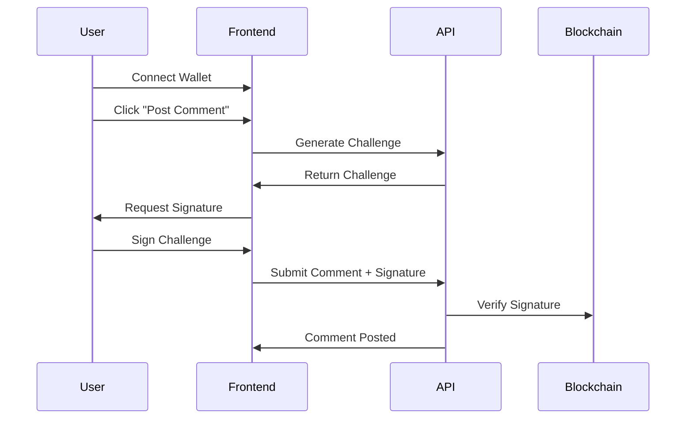
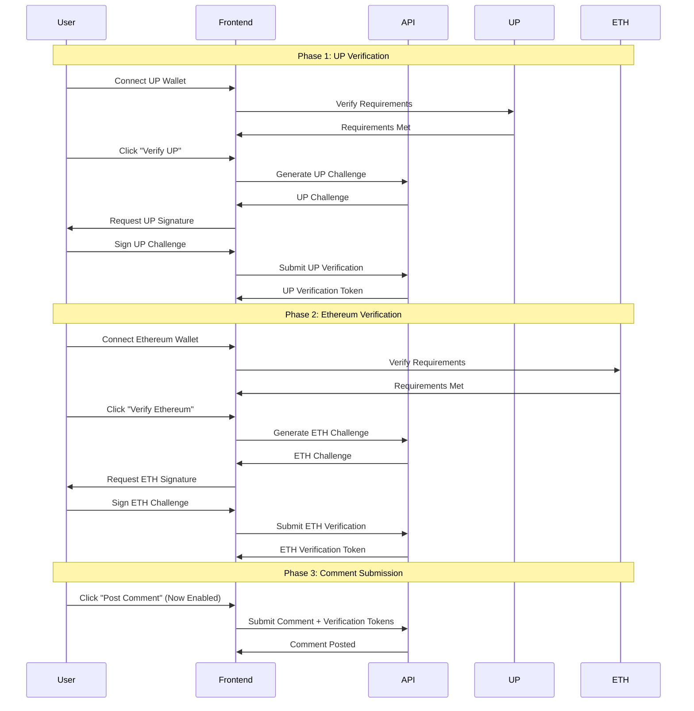

# Multi-Category Gating: Pre-Verification Architecture Research

**Date**: January 2025  
**Status**: 🔬 **Research & Analysis**  
**Issue**: Critical architectural flaw preventing multi-category gating functionality

---

## 🎯 **Executive Summary**

Our multi-category gating system has a fundamental architectural flaw that prevents users from commenting on posts with multiple gating requirements (e.g., Universal Profile + Ethereum). The current "signature-on-submit" architecture is incompatible with multi-wallet verification, requiring a complete redesign to a "pre-verification" architecture.

**Current Issue**: Users get "This post does not have gating enabled" error when trying to comment on multi-category posts.

**Root Cause**: 
1. API endpoint incompatibility with multi-category format
2. Impossible to connect multiple wallets simultaneously for signature generation
3. Single-signature flow can't handle multi-category verification

---

## ❌ **Current Issue Analysis**

### **1. Immediate API Error**

**Error Message**: `"This post does not have gating enabled"`  
**Source**: `/api/posts/[postId]/challenge` endpoint  
**Location**: `src/app/api/posts/[postId]/challenge/route.ts:70`

```typescript
// ❌ PROBLEM: Only checks legacy format
if (!SettingsUtils.hasUPGating(postSettings)) {
  return NextResponse.json({ error: 'This post does not have gating enabled' }, { status: 400 });
}
```

**Issue**: The challenge API only recognizes legacy UP gating format:
- **Legacy**: `settings.responsePermissions.upGating.enabled`
- **Multi-category**: `settings.responsePermissions.categories[]`

When user creates a dual-gated post (UP + Ethereum), it uses the multi-category format, but the challenge API doesn't recognize it.

### **2. User Flow That Fails**

1. User creates dual-gated post (UP + Ethereum) ✅
2. User connects UP wallet ✅  
3. Frontend shows UP requirements fulfilled ✅
4. User ignores Ethereum (expects requireAny logic) ✅
5. User clicks "Post Comment" ❌
6. `NewCommentForm.generateSignedChallenge()` calls `/api/posts/[postId]/challenge` ❌
7. API returns "This post does not have gating enabled" ❌

---

## 🏗️ **Architectural Flaw Analysis**

### **1. The Multi-Wallet Constraint**

**Core Problem**: Users cannot connect multiple wallets simultaneously in browsers.

#### **Current Wallet Management**
- **Universal Profile**: Web3-Onboard context (`useConditionalUniversalProfile`)
  - LUKSO network (Chain ID: 42)
  - Uses UP Social profiles
  - Web3-Onboard injected wallet provider

- **Ethereum**: Wagmi context (`useEthereumProfile`) 
  - Ethereum mainnet (Chain ID: 1)
  - Uses ENS/EFP profiles
  - Wagmi + viem + MetaMask connector

**Conflict**: These contexts manage wallet state independently and cannot be active simultaneously.

### **2. Current Single-Signature Architecture**



**Issues with Multi-Category**:
1. Only one wallet can be connected for signature
2. Challenge generation assumes single wallet type
3. Verification assumes single signature
4. No way to collect multiple signatures before submission

### **3. Multi-Category Requirements**

For a post with UP + Ethereum gating:

**Option 1: requireAll = true**
- User MUST satisfy BOTH UP and Ethereum requirements
- Needs to connect UP wallet → verify → sign
- Needs to connect Ethereum wallet → verify → sign  
- Needs to submit comment with BOTH signatures

**Option 2: requireAny = false (default)**
- User must satisfy ANY requirement (UP OR Ethereum)
- Still needs ability to choose which verification path
- Should work with current architecture, but API issue prevents it

---

## 🚀 **Proposed Solution: Pre-Verification Architecture**

### **1. Core Concept**

Move signature generation from comment submission to individual category verification.



### **2. New UI Flow**

#### **Multi-Category Verification Widget**
```
┌─────────────────────────────────────────┐
│ Verification Required                    │
│ Complete verification for any category  │
├─────────────────────────────────────────┤
│ 🆙 Universal Profile                    │
│ ✅ Requirements Met                     │
│ [Generate UP Signature] ←── Phase 1     │
├─────────────────────────────────────────┤
│ 🔷 Ethereum Profile                     │  
│ ❌ Not Connected                        │
│ [Connect Ethereum Wallet] ←── Phase 2   │
├─────────────────────────────────────────┤
│ Status: 1/2 categories verified         │
│ Ready to comment: ✅ (requireAny)       │
└─────────────────────────────────────────┘

[Post Comment] ←── Enabled when requirements met
```

### **3. Technical Architecture**

#### **A. New API Endpoints**
```
POST /api/posts/[postId]/verify-category
Body: {
  categoryType: 'universal_profile' | 'ethereum_profile',
  address: string,
  signature: string,
  challenge: VerificationChallenge
}
Response: {
  verificationToken: string,
  expiresAt: timestamp
}

POST /api/posts/[postId]/comments
Body: {
  content: string,
  parent_comment_id?: number,
  verificationTokens: string[] // Array of verification tokens
}
```

#### **B. Verification Token System**
- Each category verification generates a server-side token
- Tokens are tied to user, post, and category type
- Tokens have expiration (e.g., 15 minutes)
- Comment submission validates all required tokens
- Backend verifies token signatures on comment submission

#### **C. Modified Comment Flow**
```typescript
// 1. Category verification (per category)
const verifyCategory = async (categoryType: string, signature: string) => {
  const token = await fetch(`/api/posts/${postId}/verify-category`, {
    method: 'POST',
    body: JSON.stringify({ categoryType, signature, ... })
  });
  
  // Store token in frontend state
  setVerificationTokens(prev => ({
    ...prev,
    [categoryType]: token
  }));
};

// 2. Comment submission (only when requirements met)
const submitComment = async (content: string) => {
  const requiredTokens = getRequiredVerificationTokens();
  
  await fetch(`/api/posts/${postId}/comments`, {
    method: 'POST',
    body: JSON.stringify({
      content,
      verificationTokens: requiredTokens
    })
  });
};
```

---

## 🔧 **Implementation Plan**

### **Phase 1: Fix Immediate API Issue (Quick Fix)**
**Goal**: Allow single-category verification to work for multi-category posts

1. **Update Challenge API** to recognize multi-category format
   ```typescript
   // Fix: src/app/api/posts/[postId]/challenge/route.ts
   if (!SettingsUtils.hasAnyGating(postSettings)) {
     return NextResponse.json({ error: 'This post does not have gating enabled' }, { status: 400 });
   }
   ```

2. **Test**: User can comment on multi-category post with single verification (requireAny)

### **Phase 2: Design Pre-Verification Architecture (2-3 days)**
**Goal**: Detailed technical specification

1. **Database Design**: Verification tokens table
2. **API Design**: New endpoints and authentication
3. **Frontend State**: Token management and UI states
4. **Security Analysis**: Token validation and expiration

### **Phase 3: Implement Category Verification API (3-4 days)**
**Goal**: Backend infrastructure for pre-verification

1. **New API Endpoints**: Category verification and token generation
2. **Token System**: Secure token generation and validation
3. **Database Integration**: Store and retrieve verification tokens
4. **Security**: Rate limiting and token expiration

### **Phase 4: Implement Frontend Pre-Verification (4-5 days)**
**Goal**: Multi-category verification UI

1. **Verification Widgets**: Per-category verification flows
2. **State Management**: Track verification status across categories
3. **Token Management**: Store and use verification tokens
4. **UI Polish**: Loading states, error handling, success feedback

### **Phase 5: Integrate with Comment System (2-3 days)**  
**Goal**: Replace signature-on-submit with token-based submission

1. **Update NewCommentForm**: Use verification tokens instead of live signatures
2. **Backend Comment API**: Validate tokens instead of signatures
3. **Error Handling**: Token expiration and validation errors
4. **Backward Compatibility**: Support both old and new flows

### **Phase 6: Testing & Polish (2-3 days)**
**Goal**: Comprehensive testing and user experience

1. **End-to-End Testing**: All verification combinations
2. **Error Scenarios**: Network failures, token expiration, invalid signatures
3. **Performance**: Token cleanup and database optimization
4. **Documentation**: Update API docs and user guides

---

## 🔐 **Security Considerations**

### **1. Verification Token Security**
- **JWT-based tokens** with server-side signing
- **Short expiration** (15 minutes) to prevent replay attacks
- **User + Post + Category binding** to prevent token reuse
- **Rate limiting** on verification attempts

### **2. Signature Validation**
- **Full signature verification** during token generation (not just on comment)
- **Challenge uniqueness** to prevent signature replay
- **Chain validation** to ensure correct network signatures

### **3. Token Storage**
- **Server-side storage** of verification state
- **Frontend tokens** are opaque references, not verification data
- **Automatic cleanup** of expired tokens

---

## 📊 **Benefits of Pre-Verification Architecture**

### **1. User Experience**
- ✅ **Clear verification progress** - Users see exactly what's required
- ✅ **Flexible wallet switching** - Connect different wallets for different categories  
- ✅ **No signature surprises** - All signing happens during verification, not submission
- ✅ **Immediate feedback** - Know verification status before writing comment

### **2. Technical Benefits**
- ✅ **Scalable architecture** - Easy to add new gating categories
- ✅ **Decoupled verification** - Each category can have independent logic
- ✅ **Better error handling** - Verification failures don't block comment writing
- ✅ **Audit trail** - Server-side verification tokens provide clear history

### **3. Future Extensibility**
- ✅ **Social verification** - Twitter, GitHub, Discord integration
- ✅ **Multi-chain support** - Polygon, Arbitrum, other L2s
- ✅ **DAO membership** - Snapshot, Governor contracts
- ✅ **Credential verification** - W3C Verifiable Credentials

---

## ⚠️ **Migration Challenges**

### **1. Backward Compatibility**
- **Legacy UP posts** must continue working with old flow
- **API versioning** may be needed for smooth transition
- **Gradual rollout** to avoid breaking existing functionality

### **2. State Management Complexity**
- **Multiple verification states** to track across categories
- **Token expiration handling** and refresh logic  
- **Error recovery** when verification partially fails

### **3. Performance Considerations**
- **Database load** from verification token storage
- **Token cleanup** to prevent database bloat
- **API rate limiting** to prevent verification spam

---

## 🎛️ **Alternative Solutions Considered**

### **1. Sequential Wallet Connection**
**Idea**: Guide users through connecting each wallet in sequence during comment submission.

**Rejected because**:
- Poor user experience (multiple wallet switches during submission)
- Complex error recovery if one signature fails
- Still requires holding multiple signatures in memory

### **2. Universal Multi-Chain Wallet**
**Idea**: Use a wallet that supports both LUKSO and Ethereum simultaneously.

**Rejected because**:
- Limited wallet support for LUKSO
- Forces users to use specific wallets
- Doesn't solve the fundamental signature collection problem

### **3. Backend Signature Storage**
**Idea**: Store signatures on backend instead of verification tokens.

**Rejected because**:
- Security risk of storing private signature data
- Complex signature validation logic on every comment
- Harder to implement expiration and cleanup

---

## 📝 **Next Steps**

### **Immediate Action (Today)**
1. **Fix API compatibility** issue for basic multi-category functionality
2. **Test requireAny logic** with single verification
3. **Confirm user can comment** with partial verification

### **Short Term (This Week)**
1. **Create detailed technical specification** for pre-verification architecture
2. **Database schema design** for verification tokens
3. **API endpoint design** and authentication flows

### **Medium Term (Next 2-3 Weeks)**
1. **Implement backend verification infrastructure**
2. **Build frontend verification widgets**
3. **Integrate with existing comment system**

---

## 💡 **Key Insights**

1. **The current error is just the tip of the iceberg** - the real issue is architectural
2. **Multi-wallet verification requires pre-verification** - signature-on-submit won't work
3. **This is a significant architectural change** - not a simple bug fix
4. **The solution will greatly improve UX** - clearer verification progress and status
5. **Future extensibility will be much easier** - any verification type can be added

**Recommendation**: Proceed with the phased implementation plan, starting with the immediate API fix to unblock basic functionality, then building the proper pre-verification architecture for robust multi-category support. 