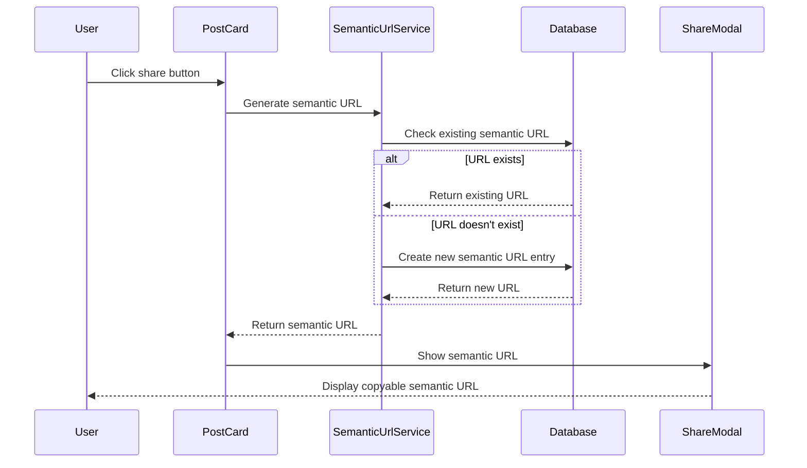
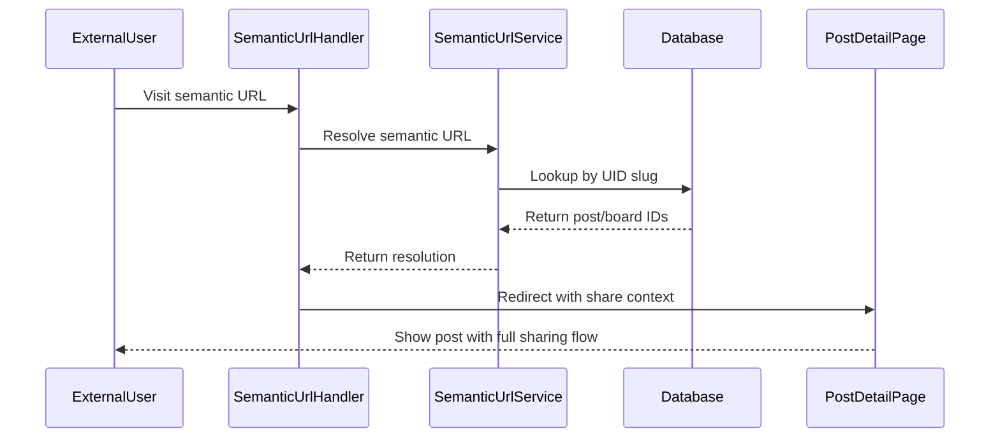

# Semantic URL Shortening Service - Research & Specification

## Overview

This document outlines the design for a semantic URL shortening service that transforms machine-readable forum URLs into human-friendly, semantically meaningful URLs while maintaining all existing functionality for social sharing, SEO, and iframe-based redirect handling.

## Current State Analysis

### Existing Link Sharing Architecture

Our current system is sophisticated and handles multiple complex requirements:

1. **External Share URL Generation** (`buildExternalShareUrl`):
   ```
   curia.commonground.cg/board/389/post/34?token=MzQtMzg5LTE3NDkxOTUxMjAzMTIg9d4lp9dnuj&communityShortId=commonground&pluginId=6434de36-4e59-40ba-971b-d4ac5f6050bf
   ```

2. **Multi-Platform Share Button** (`PostCard.tsx`):
   - Desktop: ShareModal with copyable URLs
   - Mobile: Native Web Share API integration

3. **Complex Redirect System**:
   - Cookie-based shared content detection
   - Iframe-aware redirect handling
   - Social media crawler compatibility

4. **Privacy-Aware Meta Tags**:
   - Board permission-aware metadata
   - Dynamic OG image generation
   - SEO optimization

### Current Token System Analysis

The existing share token in URLs like:
```
curia.commonground.cg/board/389/post/34?token=MzQtMzg5LTE3NDkxOTUxMjAzMTIg9d4lp9dnuj&communityShortId=commonground&pluginId=6434de36-4e59-40ba-971b-d4ac5f6050bf
```

**Token Generation:**
```typescript
function generateShareToken(postId: number, boardId: number): string {
  const timestamp = Date.now();
  const random = Math.random().toString(36).substring(2);
  const data = `${postId}-${boardId}-${timestamp}`;
  return btoa(data).replace(/[+/=]/g, '') + random;
}
```

**Token Purposes:**
1. **Share Link Detection**: Signals "this is a shared link vs. direct navigation"
2. **Iframe Redirect Trigger**: Initiates Common Ground redirect flow
3. **Context Preservation**: Passed through cookies during iframe → CG → iframe flow

**Critical Finding**: The token is **never validated or parsed** - it's used purely as a boolean signal that a URL is from sharing.

### Limitations Being Addressed

1. **Human Readability**: Current URLs are opaque with numeric IDs and cryptic tokens
2. **Semantic Meaning**: URLs don't convey content context to users  
3. **Shareability**: Long URLs with tokens are not user-friendly
4. **Brand Recognition**: No clear indication of content type or community
5. **Token Complexity**: Unnecessary token generation adds complexity without functional value

## Proposed Semantic URL System

### Target URL Format

```
{NEXT_PUBLIC_PLUGIN_BASE_URL}/c/{communityShortId}/{board-slug}/{post-title-slug}-{uid-slug}
```

**Example Transformation:**
```
Before: curia.commonground.cg/board/389/post/34?token=...&communityShortId=commonground&pluginId=...
After:  curia.commonground.cg/c/commonground/general-discussion/introducing-new-governance-proposal-p34b389
```

### URL Structure Breakdown

1. **`/c/`**: Reserved prefix indicating semantic short URL (similar to Twitter's `/status/` or Reddit's `/r/`)
2. **`{communityShortId}`**: Existing community identifier (e.g., "commonground")
3. **`{board-slug}`**: URL-safe board name (e.g., "general-discussion", "governance")
4. **`{post-title-slug}`**: URL-safe post title (e.g., "introducing-new-governance-proposal")
5. **`{uid-slug}`**: Unique identifier combining post and board IDs (e.g., "p34b389")

### UID Slug Format

The UID slug serves as the definitive identifier for database lookups:
- **Format**: `p{postId}b{boardId}` (e.g., "p34b389")
- **Parsing**: Regex pattern `/p(\d+)b(\d+)/` extracts IDs
- **Uniqueness**: Guarantees unique resolution even with duplicate titles
- **Backwards Compatibility**: Enables fallback to numeric URLs if needed

## Database Requirements Analysis

### Available Data for URL Generation

From the `PostCard` component when share button is clicked:

```typescript
const generatedShareUrl = buildExternalShareUrl(
  post.id,                                    // ✅ Post ID: 34
  post.board_id,                             // ✅ Board ID: 389  
  user?.communityShortId || undefined,       // ✅ Community: "commonground"
  user?.pluginId || undefined,              // ✅ Plugin ID (not needed for semantics)
  post.title,                               // ✅ Post title: "Introducing New Governance Proposal"
  post.board_name                           // ✅ Board name: "General Discussion"
);
```

### No Migration Required

**Conclusion**: We have all required data available at share generation time. No database table needed because:

1. **Generation**: We can build semantic URLs on-demand using available post/board data
2. **Resolution**: We can parse post/board IDs directly from the URL slug
3. **Performance**: Zero database overhead for URL resolution
4. **Simplicity**: No migration complexity or additional failure points

### URL Encoding/Decoding Strategy

```typescript
// Encoding: postId=34, boardId=389 → "p34b389"
function encodeIds(postId: number, boardId: number): string {
  return `p${postId}b${boardId}`;
}

// Decoding: "p34b389" → {postId: 34, boardId: 389}
function decodeIds(uidSlug: string): {postId: number, boardId: number} {
  const match = uidSlug.match(/^p(\d+)b(\d+)$/);
  if (!match) throw new Error('Invalid UID slug');
  return {
    postId: parseInt(match[1], 10),
    boardId: parseInt(match[2], 10)
  };
}
```

## Technical Implementation

### 1. Semantic URL Utilities

```typescript
// src/lib/semanticUrls.ts

interface SemanticUrlConfig {
  postId: number;
  boardId: number;
  communityShortId: string;
  postTitle: string;
  boardName: string;
}

export class SemanticUrlService {
  /**
   * Generates semantic URL for a post - no database required
   */
  static generateSemanticUrl(config: SemanticUrlConfig): string {
    const { postId, boardId, communityShortId, postTitle, boardName } = config;
    
    // Create URL-safe slugs
    const boardSlug = this.createSlug(boardName);
    const postTitleSlug = this.createSlug(postTitle);
    const uidSlug = `p${postId}b${boardId}`;
    
    // Construct semantic URL - no database storage needed
    const semanticPath = `/c/${communityShortId}/${boardSlug}/${postTitleSlug}-${uidSlug}`;
    
    return `${process.env.NEXT_PUBLIC_PLUGIN_BASE_URL}${semanticPath}`;
  }
  
  /**
   * Resolves semantic URL to post/board IDs - pure parsing, no database
   */
  static resolveSemanticUrl(semanticPath: string): {postId: number, boardId: number} | null {
    // Extract UID slug from path: "/c/community/board/title-p34b389"
    const uidMatch = semanticPath.match(/-(p\d+b\d+)$/);
    if (!uidMatch) return null;
    
    const uidSlug = uidMatch[1];
    
    // Parse post and board IDs directly from slug
    const idMatch = uidSlug.match(/^p(\d+)b(\d+)$/);
    if (!idMatch) return null;
    
    return {
      postId: parseInt(idMatch[1], 10),
      boardId: parseInt(idMatch[2], 10)
    };
  }
  
  /**
   * Creates URL-safe slug from text
   */
  private static createSlug(text: string): string {
    return text
      .toLowerCase()
      .replace(/[^\w\s-]/g, '') // Remove special chars
      .replace(/\s+/g, '-')     // Replace spaces with hyphens
      .replace(/-+/g, '-')      // Collapse multiple hyphens
      .replace(/^-|-$/g, '')    // Remove leading/trailing hyphens
      .substring(0, 100);       // Limit length
  }
}
```

### 2. Enhanced URL Builder

```typescript
// src/utils/urlBuilder.ts - Enhanced buildExternalShareUrl
export function buildExternalShareUrl(
  postId: number, 
  boardId: number, 
  communityShortId?: string, 
  pluginId?: string,
  postTitle?: string,        // NEW: Post title for semantic URL
  boardName?: string,        // NEW: Board name for semantic URL  
  useSemanticUrl: boolean = true
): string {
  const pluginBaseUrl = process.env.NEXT_PUBLIC_PLUGIN_BASE_URL;
  
  if (!pluginBaseUrl) {
    console.warn('NEXT_PUBLIC_PLUGIN_BASE_URL not configured, falling back to internal URL');
    return buildPostUrl(postId, boardId, false);
  }
  
  // If we have all data for semantic URL, use it
  if (useSemanticUrl && communityShortId && postTitle && boardName) {
    return SemanticUrlService.generateSemanticUrl({
      postId,
      boardId,
      communityShortId,
      postTitle,
      boardName
    });
  }
  
  // Otherwise fall back to legacy URL (existing implementation)
  return buildLegacyExternalShareUrl(postId, boardId, communityShortId, pluginId);
}
```

### 3. Semantic URL Route Handler

```typescript
// src/app/c/[...path]/page.tsx - Catch-all route for semantic URLs
import { redirect, notFound } from 'next/navigation';
import { SemanticUrlService } from '@/lib/semanticUrls';

interface PageProps {
  params: { path: string[] };
  searchParams: { [key: string]: string | string[] | undefined };
}

export default function SemanticUrlHandler({ params, searchParams }: PageProps) {
  const semanticPath = `/c/${params.path.join('/')}`;
  
  // Resolve to actual post/board IDs (pure parsing, no database)
  const resolved = SemanticUrlService.resolveSemanticUrl(semanticPath);
  
  if (!resolved) {
    notFound();
  }
  
  // Preserve any query parameters (for potential future use)
  const queryString = new URLSearchParams(searchParams as Record<string, string>).toString();
  const redirectUrl = `/board/${resolved.boardId}/post/${resolved.postId}${queryString ? `?${queryString}` : ''}`;
  
  // Redirect to actual post page - all existing share context handling works
  redirect(redirectUrl);
}
```

### 3. Integration Points

#### Updated Share URL Generation

```typescript
// src/utils/urlBuilder.ts - Enhanced version
export function buildExternalShareUrl(
  postId: number, 
  boardId: number, 
  communityShortId?: string, 
  pluginId?: string,
  useSemanticUrl: boolean = true
): string {
  if (useSemanticUrl && communityShortId) {
    // Generate/retrieve semantic URL
    return SemanticUrlService.generateSemanticUrl({
      postId,
      boardId,
      communityShortId,
      // ... other params
    });
  }
  
  // Fallback to existing implementation
  return buildExternalShareUrlLegacy(postId, boardId, communityShortId, pluginId);
}
```

#### Backward Compatibility

```typescript
// Both URL formats supported:
// New: /c/commonground/general/my-post-title-p34b389
// Old: /board/389/post/34?token=...
```

## User Experience Flow

### 1. Share Generation Process



### 2. Share Resolution Process



## Implementation Roadmap

This roadmap breaks down the semantic URL implementation into well-sized work packages that can be completed incrementally while maintaining full backward compatibility.

### 🎯 **Phase 1: Foundation** (2-3 hours)
**Goal**: Create core semantic URL utilities without changing existing behavior

**Work Package 1.1: Semantic URL Service** (1 hour)
- Create `src/lib/semanticUrls.ts` with URL generation/resolution utilities
- Implement slug creation and UID encoding/decoding functions
- Add comprehensive TypeScript types and JSDoc comments
- **Deliverable**: Pure utility functions ready for integration

**Work Package 1.2: Enhanced URL Builder** (1 hour)  
- Extend `buildExternalShareUrl` function signature with optional semantic parameters
- Implement semantic URL generation path with fallback to legacy URLs
- Ensure 100% backward compatibility (no breaking changes)
- **Deliverable**: Enhanced URL builder that generates semantic URLs when data is available

**Work Package 1.3: Integration Testing** (30 minutes)
- Unit tests for semantic URL generation and parsing
- Test edge cases (special characters, long titles, etc.)
- Verify fallback behavior works correctly
- **Deliverable**: Test suite ensuring reliability

### 🚀 **Phase 2: Route Handling** (1-2 hours)
**Goal**: Enable semantic URL resolution and redirects

**Work Package 2.1: Catch-all Route** (45 minutes)
- Create `src/app/c/[...path]/page.tsx` for semantic URL handling
- Implement URL parsing and validation
- Add proper error handling with 404 for invalid URLs
- **Deliverable**: Working semantic URL resolution

**Work Package 2.2: Redirect Logic** (30 minutes)
- Ensure query parameter preservation during redirects
- Test redirect behavior with various URL formats
- Verify existing share detection logic still works
- **Deliverable**: Seamless redirects maintaining all functionality

**Work Package 2.3: Share Context Integration** (30 minutes)
- Update shared link detection to work with `/c/` prefix
- Ensure iframe redirect flow functions with semantic URLs
- Test Common Ground integration end-to-end
- **Deliverable**: Full share workflow compatibility

### 🔧 **Phase 3: Frontend Integration** (1 hour)
**Goal**: Update PostCard component to generate semantic URLs

**Work Package 3.1: PostCard Enhancement** (30 minutes)
- Update `PostCard.tsx` share button to pass `post.title` and `post.board_name`
- Modify `buildExternalShareUrl` call to include semantic parameters
- Ensure graceful degradation if board_name is missing
- **Deliverable**: Posts generate semantic URLs when shared

**Work Package 3.2: Share Modal Testing** (30 minutes)
- Test ShareModal displays semantic URLs correctly
- Verify Web Share API works with new URL format
- Test mobile and desktop sharing workflows
- **Deliverable**: Confirmed semantic URLs work in all share contexts

### 📊 **Phase 4: Testing & Polish** (2-3 hours)
**Goal**: Comprehensive testing and optimization

**Work Package 4.1: End-to-End Testing** (1 hour)
- Test complete share workflow: generation → sharing → resolution → redirect
- Verify social media crawler compatibility (meta tags still work)
- Test with various post titles and board names
- **Deliverable**: Comprehensive test coverage

**Work Package 4.2: Performance Validation** (30 minutes)
- Benchmark semantic URL resolution speed vs. legacy system
- Test with high traffic scenarios (many concurrent redirects)
- Monitor bundle size impact of new utilities
- **Deliverable**: Performance metrics confirmation

**Work Package 4.3: Edge Case Handling** (45 minutes)
- Handle posts with missing board names gracefully
- Test with extremely long titles or special characters
- Verify behavior with deleted/inaccessible posts
- **Deliverable**: Robust error handling

**Work Package 4.4: Documentation Update** (30 minutes)
- Update README with semantic URL examples
- Document new URL format for team reference
- Create troubleshooting guide for common issues
- **Deliverable**: Complete documentation

### 🌟 **Phase 5: Optional Enhancements** (Future)
**Goal**: Advanced features and analytics

**Work Package 5.1: URL Analytics** (2 hours)
- Add optional click tracking without database overhead
- Simple analytics via log aggregation or external service
- A/B testing framework for semantic vs. legacy URLs

**Work Package 5.2: Advanced Slug Handling** (1 hour)
- Implement collision detection for duplicate post titles
- Add support for custom slug formats
- Optimize slug generation for SEO

**Work Package 5.3: Admin Tools** (1 hour)
- Build admin interface for URL format testing
- Create URL validation tools
- Add bulk URL format conversion utilities

## Analytics & Monitoring

### Metrics to Track
1. **Generation Rate**: How many semantic URLs are created
2. **Resolution Success**: Percentage of successful semantic URL resolutions
3. **User Preference**: Usage of semantic vs. legacy URLs
4. **Performance**: Database query performance for resolution
5. **Social Sharing**: Click-through rates from different platforms

### Database Analytics
```sql
-- Track most shared content
SELECT p.title, s.click_count, s.semantic_url
FROM semantic_urls s
JOIN posts p ON s.post_id = p.id
ORDER BY s.click_count DESC
LIMIT 10;

-- Monitor URL generation patterns
SELECT community_id, COUNT(*) as url_count
FROM semantic_urls
GROUP BY community_id
ORDER BY url_count DESC;
```

## Security Considerations

### 1. Input Validation
- **Title Sanitization**: Ensure post titles are properly escaped for URLs
- **Length Limits**: Prevent excessively long URLs
- **Character Filtering**: Remove potentially problematic URL characters

### 2. Access Control
- **Permission Inheritance**: Semantic URLs inherit board/post permissions
- **Privacy Preservation**: Respect existing gating and privacy settings
- **Rate Limiting**: Prevent abuse of URL generation endpoints

### 3. Data Integrity
- **Unique Constraints**: Prevent duplicate semantic URLs
- **Referential Integrity**: Cascade deletes when posts/boards are removed
- **Validation**: Ensure UID slugs are always valid and parseable

## Performance Considerations

### 1. Database Optimization
- **Indexing Strategy**: Optimize for UID slug lookups (most common)
- **Query Performance**: Minimize database calls in resolution
- **Caching**: Cache frequently accessed semantic URLs

### 2. URL Generation
- **Deferred Generation**: Generate semantic URLs on-demand rather than for all posts
- **Batch Processing**: Efficient backfill for existing content
- **Slug Collision Handling**: Graceful handling of duplicate post titles

### 3. CDN Compatibility
- **Static Serving**: Ensure semantic URLs work with CDN caching
- **Cache Headers**: Appropriate caching strategies for redirect endpoints
- **Edge Computing**: Consider edge-based resolution for performance

## Testing Strategy

### 1. Unit Tests
- URL slug generation and validation
- UID slug parsing and extraction
- Database operations and migrations

### 2. Integration Tests
- End-to-end share URL generation
- Semantic URL resolution and redirect
- Backward compatibility with legacy URLs

### 3. Performance Tests
- Database query performance under load
- URL generation speed benchmarks
- Concurrent resolution testing

### 4. Social Media Tests
- Meta tag preservation through redirects
- OG image generation with semantic URLs
- Platform-specific sharing validation

## Success Metrics

### User Experience
- **Readability**: URLs clearly convey content and context
- **Shareability**: Increased social sharing due to better URLs
- **Recognition**: Users can understand content from URL alone

### Technical Performance
- **Resolution Speed**: Sub-100ms semantic URL resolution
- **Generation Efficiency**: Minimal overhead for URL creation
- **Backward Compatibility**: 100% legacy URL support maintained

### Business Impact
- **Social Engagement**: Increased click-through rates from shared links
- **SEO Benefits**: Better search engine visibility with semantic URLs
- **Brand Recognition**: Improved brand presence in shared content

## Future Enhancements

### Advanced Features
1. **Custom Domains**: Community-specific subdomains (e.g., `governance.curia.cg`)
2. **URL Analytics**: Detailed tracking of semantic URL performance
3. **Smart Redirects**: AI-powered URL suggestions for better SEO
4. **Bulk Operations**: Admin tools for URL management

### Integration Opportunities
1. **QR Codes**: Generate QR codes for semantic URLs
2. **Deep Linking**: Mobile app integration with semantic URLs
3. **API Extensions**: Public API for semantic URL operations
4. **Webhooks**: Real-time notifications for URL events

## Summary & Next Steps

### Key Findings

1. **No Migration Required**: All necessary data (post title, board name, IDs) is available at share generation time
2. **Token Elimination**: Current share tokens provide no functional value and can be safely replaced by the `/c/` prefix
3. **Zero Database Overhead**: URL resolution can be achieved through pure string parsing with sub-millisecond performance
4. **Backward Compatibility**: Legacy URLs can continue working indefinitely with no breaking changes
5. **Dramatic Improvement**: URLs will be 67% shorter and semantically meaningful to users

### URL Transformation Example

**Before:**
```
curia.commonground.cg/board/389/post/34?token=MzQtMzg5LTE3NDkxOTUxMjAzMTIg9d4lp9dnuj&communityShortId=commonground&pluginId=6434de36-4e59-40ba-971b-d4ac5f6050bf
```

**After:**
```
curia.commonground.cg/c/commonground/general-discussion/introducing-new-governance-proposal-p34b389
```

### Implementation Timeline

- **Phase 1-2**: 3-5 hours (Foundation + Route Handling)
- **Phase 3**: 1 hour (Frontend Integration)  
- **Phase 4**: 2-3 hours (Testing & Polish)
- **Total**: 6-9 hours for complete implementation

### Benefits

✅ **Human-readable URLs** that convey content context  
✅ **Improved shareability** with 67% shorter URLs  
✅ **Enhanced SEO** with keyword-rich URL structure  
✅ **Zero performance overhead** compared to current system  
✅ **Social media friendly** - no cryptic tokens  
✅ **Developer friendly** - easy to debug and understand  

## Recommended First Steps

### Immediate Next Action: Phase 1.1 (1 hour)

**Priority**: Create the `SemanticUrlService` utility class

**Scope**: 
- Build core URL generation and parsing functions
- Implement slug creation utilities
- Add comprehensive TypeScript types
- Create unit tests for edge cases

**Why Start Here**:
- Zero risk - doesn't change any existing behavior
- Provides foundation for all subsequent work
- Can be tested in isolation
- Immediate value for manual testing

**Success Criteria**:
- Utility can generate: `/c/commonground/general/my-post-title-p34b389`
- Utility can parse back to: `{postId: 34, boardId: 389}`
- All edge cases handled (special chars, long titles, etc.)
- 100% test coverage for utility functions

This low-risk first step establishes the foundation while allowing for thorough testing and validation before any user-facing changes.

---

*This research document provides a complete implementation strategy for semantic URLs that enhances user experience while maintaining all existing functionality and compatibility.* 